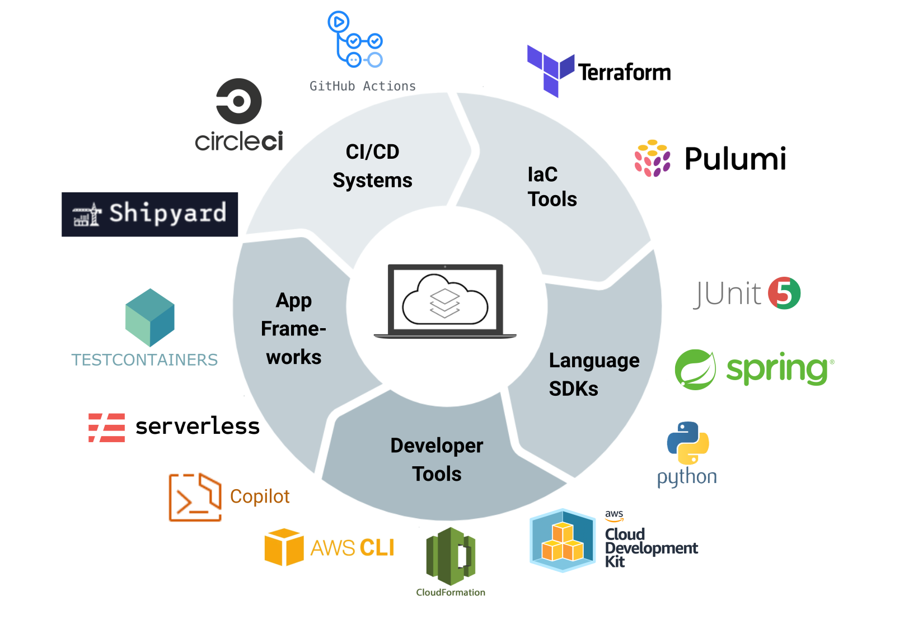

## [AWS Localstack](https://localstack.cloud/) The AWS Cloud on your local machine `OPTIONAL`
- A fully functional local cloud stack to Develop and test your cloud and serverless apps offline!
- AWS only at the time of writing
- [Getting started](https://docs.localstack.cloud/get-started/)
- [Localstack Docs](https://docs.localstack.cloud/overview/)
- [Integrations](https://docs.localstack.cloud/integrations/)
- [Localstack Cockpit Web UI](https://localstack.cloud/products/cockpit/)
- [AWS Feature Coverage](https://docs.localstack.cloud/aws/feature-coverage/)

## Integrations
- [Serverless Framework](https://docs.localstack.cloud/integrations/serverless-framework/)
- [Spring Cloud Function](https://docs.localstack.cloud/integrations/spring-cloud-function/)
- [Architect](https://docs.localstack.cloud/integrations/architect/)
- [AWS Copilot CLI](https://docs.localstack.cloud/integrations/copilot/)
- [Terraform](https://docs.localstack.cloud/integrations/terraform/)
- [Thundra](https://docs.localstack.cloud/integrations/thundra/)
- [AWS SAM](https://docs.localstack.cloud/integrations/aws-sam/)
- [AWS CDK](https://docs.localstack.cloud/integrations/aws-cdk/)
- [Pulumi](https://docs.localstack.cloud/integrations/pulumi/)
- [Kafka cluster](https://docs.localstack.cloud/integrations/kafka/)
- [AWS Chalice](https://docs.localstack.cloud/integrations/chalice/)



## Language SDKS

- [.NET](https://docs.localstack.cloud/integrations/sdks/dotnet/)
- [Go](https://docs.localstack.cloud/integrations/sdks/go/)
- [PHP](https://docs.localstack.cloud/integrations/sdks/php/)
- [Python: BOTO3](https://docs.localstack.cloud/integrations/sdks/python/)

## Requirements
- Docker installed & running
- [LocalStack CLI](https://docs.localstack.cloud/get-started/#localstack-cli)
- [Install AWS CLI](https://docs.localstack.cloud/integrations/aws-cli/)

## Up & Running
- Configure AWS Profile & Credentials
- Create a blank `config` & `credential` file with `vi` or `touch` & copy the below into each file

`.aws/config`
```
[default]
region = eu-central-1
output = yaml

[profile localstack]
region = eu-central-1
output = yaml
```
`.aws/credentials`
```
[localstack]
aws_access_key_id = test
aws_secret_access_key = test
```
- Start LocalStack from the command line `localstack start`
- Test you can hit a endpoint `aws --profile localstack --endpoint-url=http://localhost:4566 kinesis list-streams`

## Endpoints
```
  endpoints {
    apigateway     = "http://localhost:4566"
    apigatewayv2   = "http://localhost:4566"
    cloudformation = "http://localhost:4566"
    cloudwatch     = "http://localhost:4566"
    dynamodb       = "http://localhost:4566"
    ec2            = "http://localhost:4566"
    es             = "http://localhost:4566"
    elasticache    = "http://localhost:4566"
    firehose       = "http://localhost:4566"
    iam            = "http://localhost:4566"
    kinesis        = "http://localhost:4566"
    lambda         = "http://localhost:4566"
    rds            = "http://localhost:4566"
    redshift       = "http://localhost:4566"
    route53        = "http://localhost:4566"
    s3             = "http://s3.localhost.localstack.cloud:4566"
    secretsmanager = "http://localhost:4566"
    ses            = "http://localhost:4566"
    sns            = "http://localhost:4566"
    sqs            = "http://localhost:4566"
    ssm            = "http://localhost:4566"
    stepfunctions  = "http://localhost:4566"
    sts            = "http://localhost:4566"
```